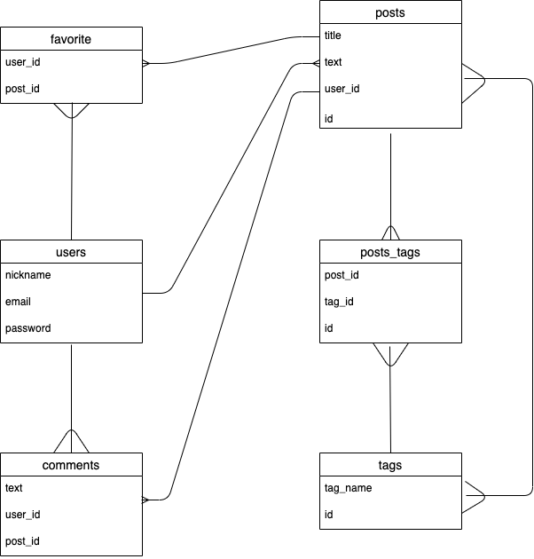

# README

# アプリケーション名
- os-original

## アプリケーション概要

- アプリケーションの概要は大きく分けて二つあります。
- 一つ目は、プログラミング学習における基礎知識と学習の補助。
- 二つ目は、ユーザーが互いに知識共有や学び合いをし、アウトプットできる環境を設ける。

- 次に説明と利用方法です。一つ目は【1】、二つ目は【2】と表記します。
- 【1】の説明としましては、主にプログラミング初学者が学習中に起こり得る問題として、言葉や文字だけでは内容の理解が難しいと思うことがあると思います。そこでコードとイメージ図を照らし合わせ流れを可視化できるアプリケーションがあれば、理解するきっかけを掴む事を目的としています。例えばMVCの流れが理解したつもりだったがコードで見るとわからなくなる方などです。  
利用方法は、新規登録（ログイン）しなくてもトップページから言語選択が可能なので閲覧したい言語をクリックしていくことになります。（この情報はアプリケーション管理者が作成し随時更新）
- 【2】の説明としましては、プログラミング学習中の不明点を検索して調べる時に情報が多すぎてどれを参考にして良いのかわからないことや、参考になった数多くの説明サイト、Q&A、記事などを見返したい。このような事を再度検索し直すのは効率が悪いと思い、ひとつのアプリケーションでユーザー同士が情報・知識の共有、学び合い、アウトプット、質疑応答などをすることによって学習補助につなげる事が目的となります。  
利用方法は、新規登録（ログイン）しているユーザーが記事、Q&Aの投稿、記事へのお気に入り登録、マイページ機能が利用可能です。ログアウト状態のユーザーが使える機能は記事の閲覧、検索機能となっております。

- 以上が概要となります。

## URL
- デプロイ次第記述します。

## テスト用アカウント
- 実装次第記述します

## 目指した課題解決
- プログラミング学習をしている人で不明点の問題解決に役立つ

## 洗い出した要件
### ユーザー登録
- 記事閲覧はログアウト状態でもできるが投稿する場合はログインが必要
### 記事投稿機能,コメント機能
- ユーザー同士による知識の情報共有、アウトプット、質疑応答
### 記事検索機能
- 投稿された記事のタイトルからキーワードで検索できる
### お気に入り機能
- お気に入り機能を実装することによりマイページで確認でき、いつでも見返せる
### タグ付機能
- 投稿する記事にタグ付をし記事の種類を分ける
### Q&A機能
- 知りたい情報が記事にないときなどにQ&A機能を活用

## 実装した機能についてのGIFと説明
- 実装次第記述します

## 実装予定の機能
- ユーザー登録機能
- 記事投稿機能
- コメント機能
- 記事検索機能
- お気に入り機能
- タグ付機能
- Q&A機能

## データベース設計
- 

## ローカルでの動作方法
- 実装次第記述します

## usersテーブル

| Colum              | Type    | Option         |
| ------------------ | ------- | -------------- |
| nickname           | string  | null: false    |
| email              | string  | null: false, unique: true   |
| encrypted_password | string  | null: false    |

### Association
- has_many :posts
- has_many :comments
- has_many :favorites

## postsテーブル

| Colum | Type       | Option                         |
| ----- | ---------- | ------------------------------ |
| title | string     | null: false                    |
| text  | text       | null: false                    |
| user  | references | null: false, foreign_key: true |
 
 ### Association
- has_many :comments
- has_many :favorites
- has_many :posts_tags
- has_many :tags, through: posts_tags

## commentsテーブル

| Colum | Type       | Option                         |
| ----- | ---------- | ------------------------------ |
| text  | text       | null: false                    |
| user  | references | null: false, foreign_key: true |
| post  | references | null: false, foreign_key: true |

### Association
- belongs_to :user
- belongs_to :post

## favoritesテーブル

| Colum | Type       | Option                         |
| ----- | ---------- | ------------------------------ |
| user  | references | null: false, foreign_key: true |
| post  | references | null: false, foreign_key: true |

### Association
- belongs_to :user
- belongs_to :post

## tagsテーブル

| Colum     | Type       | Option                         |
| --------- | ---------- | ------------------------------ |
| tag_name  | string     | null: false                    |

### Association
- has_many :posts_tags
- has_many :posts, through: posts_tags

## posts_tagsテーブル

| Colum     | Type       | Option                         |
| --------- | ---------- | ------------------------------ |
| post  | references | null: false, foreign_key: true |
| tag   | references | null: false, foreign_key: true |

### Association
- belongs_to :post
- belongs_to :tag